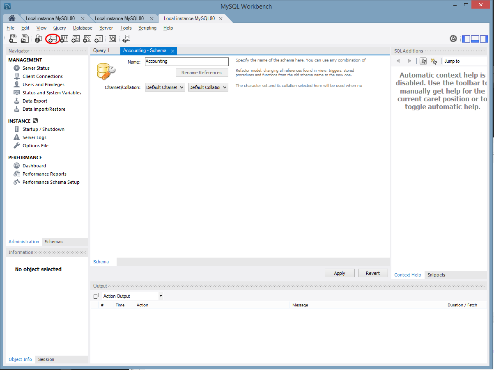
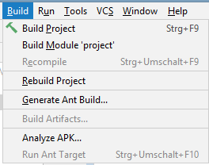
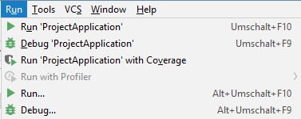

# Accounting

### Project description 


### Requirements
1) mysql 5.7 or above 
2) maven 
    (
    
    -ubuntu sudo apt install maven ,
    
    -[windows](https://maven.apache.org/download.cgi)
3) jdk 
4) IDE

### Clone project 
```
git clone https://github.com/tel-ran-de/Accounting
```
### Install and run MySQL 

#### Linux (In Console )
```
$ sudo apt update
$ sudo apt install mysql-server
$ sudo mysql_secure_installation
```


##### Authentication Setup in MySQL
```
$ sudo mysql

mysql> SELECT user,authentication_string,plugin,host FROM mysql.user;
```

```
+------------------+-------------------------------------------+-----------------------+-----------+
| user             | authentication_string                     | plugin                | host      |
+------------------+-------------------------------------------+-----------------------+-----------+
| root             |                                           | auth_socket           | localhost |
| mysql.session    | *THISISNOTAVALIDPASSWORDTHATCANBEUSEDHERE | mysql_native_password | localhost |
| mysql.sys        | *THISISNOTAVALIDPASSWORDTHATCANBEUSEDHERE | mysql_native_password | localhost |
| debian-sys-maint | *CC744277A401A7D25BE1CA89AFF17BF607F876FF | mysql_native_password | localhost |
+------------------+-------------------------------------------+-----------------------+-----------+
4 rows in set (0.00 sec)
```

```
mysql> ALTER USER 'root'@'localhost' IDENTIFIED WITH mysql_native_password BY 'password';
```
`password `- instead you must enter your password;

 password and username must be identical with those specified in 'aplication.properties'


#### Windows (In IDE)

[Download and Install MySQL](https://dev.mysql.com/downloads/file/?id=488055)

Caution!
You will need the password that you enter during installation in the future when you start the application (application.properties)

##### Authentication Setup in MySQL(Workbench)
 1.Log in with your username and password that you specified during
 installation :


 2.Create a new scheme that you will use later in the project :
 
 
 
 Now go to the IDE(example from IntelliJ IDEA) and on the right side of
 the screen click on the tab Database> Data Source Properties :


Change the driver version to 5.1 (if you are asked to download them, agree)
and enter username and password


 

### Build project 

#### Linux (In Console )
```
 mvn -f pom.xml clean package 
```

```
And you should get:
```


This is the name of your ```jar``` file that you need when you run the project in the next step
```
target/project-0.0.1-SNAPSHOT.jar
```
#### Windows (In IDE)


### Run the project 

#### Linux (In Console )

Run in the project directory:

```
java -jar target/project-0.0.1-SNAPSHOT.jar
```
#### Windows (In IDE)

 

Or with Docker:
```
docker-compose up -d
```

### Build the Project manually
To run the project you need to have installed [Docker](http://docker.com) with Docker-compose.  
To run the mysql DB first: 
```
docker-compose up -d db
```

Run in the project directory:
```
docker build -t accounting .
```
It will use 2 step-build in Dockerfile and create docker image accounting:lastest. 
1st step pulls maven as a container and builds project, 
2nd step uses jar file, prepared in maven 1st step. 

### Tests 
Tests are removed in dockerfile during build with -Dmaven.test.skip=true to compile with no DB

### Project Status

### Technologies 

### Sources
